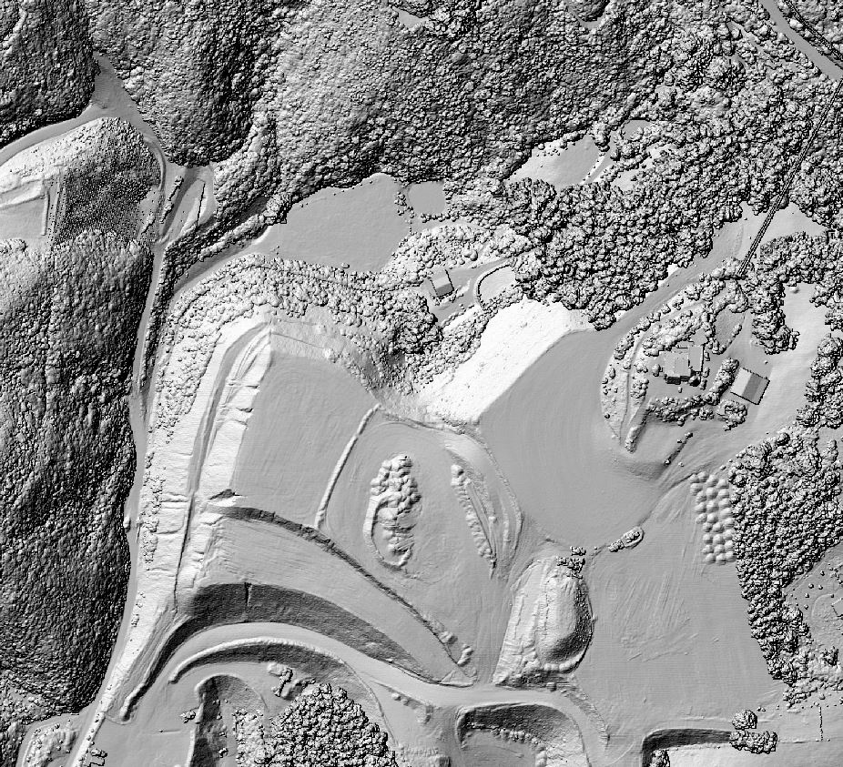
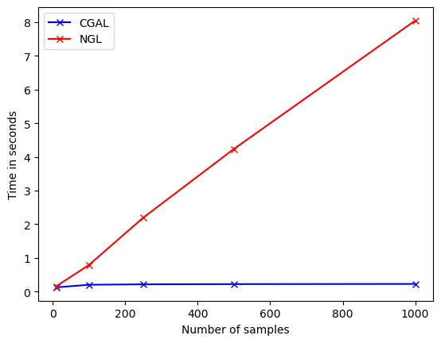

# Fast Natural Neighbor Interpolation for Python using CGAL

[](https://github.com/manaakiwhenua/manaakiwhenua-standards)

Author: Dr Jan Schindler (schindlerj@landcareresearch.co.nz)

## Installation
### Ubuntu with conda
Install development packages in Ubuntu:<br>
`sudo apt install g++ cmake libgmp10 libgmp-dev libmpfr6 libmpfrc++-dev libmpfi-dev`

Create Python environment:<br>
`conda create --name nnpycgal -c conda-forge python=3.8 numpy cgal -c conda-forge`

Activate the environment:<br>
`conda activate nnpycgal`

Build and install the Python C++ extension:<br>
`python setup.py install`

### Ubuntu 20

Install development packages in Ubuntu:<br>
`sudo apt install g++ cmake libgmp10 libgmp-dev libmpfr6 libmpfrc++-dev libmpfi-dev libcgal-dev python3-setuptools python3-dev`

Build: <br>
`python3 setup.py build`

Install:<br>
`sudo python3 setup.py install`


## Example

```python
import datetime
from nnpycgal.nninterpol import nninterpol
import numpy as np

step = 1
nx, ny = 1000, 1000
nsamples = 100
xo = np.arange(0, nx, step)
yo = np.arange(0, ny, step)
xx, yy = np.meshgrid(xo, yo)

x = np.random.randint(0, nx, nsamples)
y = np.random.randint(0, ny, nsamples)
z = np.random.random(nsamples)

result = np.array(nninterpol(x, y, z, nx, ny))
```


## Surface interpolation from LiDAR point clouds
This implementation also works well for surface model generation from LiDAR data (~4.5 million points):




## Benchmark against PyNGL

Natural Neighbor interpolation in CGAL can be extremely fast compared to other libraries such as PyNGL's *natgrid* method [https://www.pyngl.ucar.edu/Functions/Ngl.natgrid.shtml]. This is achieved in this C++ extension with an efficient look-up table and multiprocessing with OpenMP.

#### Increase number of sample values (1000x1000 pixel grid)



#### Increase of grid size in pixels (500 sample values)


